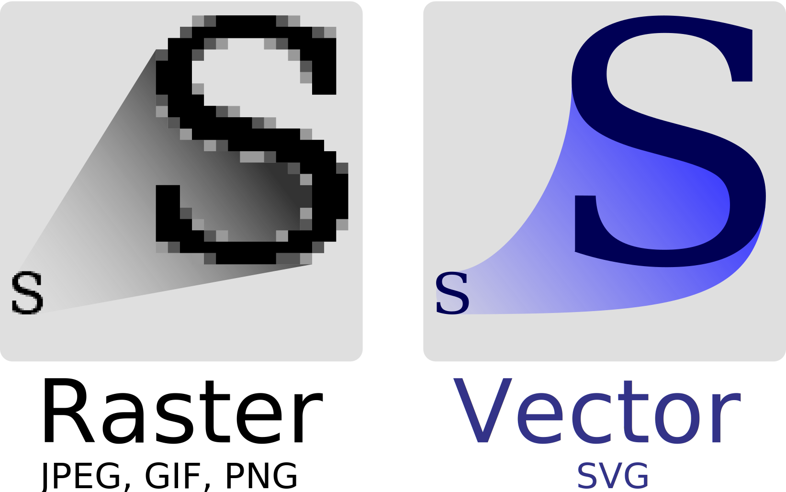

# Example 'Images' (2829336905)

## Question for local image (3b100ad7-1a75-46bb-85c7-2d0bf1bd3345)

Answer that has an image that is linked through a local file path:

## Question that contains local image (00b3d5fe-62dd-48ae-9843-0a592fec780c)

---

Answer to that question

## Question with answer online SVG image (3b100ad7-1a75-46bb-85c7-2d0bf1bd3345)

---

Answer that has an image that is linked through a local SVG file path:

