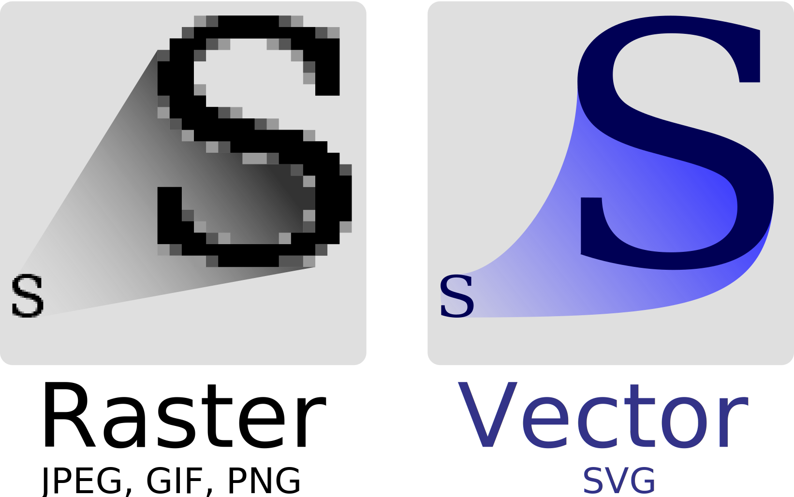

# Example 'Multi Part' (2829336909)

Part 1/3

`{=:multi_part_1_of_3:=}`

## Question with inline formula $\omega = a^2 + 10$ (a010fdca-d52f-42a5-baf4-fb60cbf2c9cc)

Answer with inline formula $100 = 10 * 10 x + 3$

## Question with multiline/displaystyle formula: (3388caf3-9d10-476d-b134-5c04c7748c6e)

$$
a = 10 * \begin{cases}
1 & \text{yes} \\
0 & \text{else}
\end{cases}
$$

---

Answer with multiline/displaystyle formula:

$$
b = \omega * \begin{cases}
1 & \text{no} \\
0 & \text{else}
\end{cases}
$$

## Question for online image (b39b3889-1e75-4c43-ae20-96a3dbe2f52d)

Answer that has an image that is linked by an URL:


## Question for local image (9519b7e3-8dca-45c5-b726-131de9941a66)

Answer that has an image that is linked through a local file path:


## Question that contains online image (a7128d5d-f0dc-481a-915f-e1cd96595ce5)


---

Answer to that question

## Question that contains local image (afbefaf5-51bf-4e78-807c-b1f6da06f279)


---

Answer to that question

## Question with online SVG image (ce630e3d-0e8a-40d4-89c6-1fb0550c35d2)


---

Answer that has an image that is linked through a local SVG file path:



## Question with inline code `camelCaseVar()` (9750f8fa-b0d4-40d7-8f1c-e1fec8c5b2e9)

Answer with `inline` code

## Question with code block: (d7bc8494-544b-4eed-942f-ec31b8719ce3)

```html
<!doctype html>
<html lang="en">
<head>
  <meta charset="utf-8">
  <title>Title</title>
  <meta name="description" content="description">
  <meta name="author" content="Author">
  <link rel="stylesheet" href="css/styles.css">
</head>
<body>
  <script src="js/script.js"></script>
</body>
</html>
```

---

Answer with code block:

```cpp
#include <iostream>
using namespace std;

int main() {
	cout << "Hello World!" << endl; // prints Hello World!
	return 0;
}
```

## Question for online image (b39b3889-1e75-4c43-ae20-96a3dbe2f52d)

Answer that has an image that is linked by an URL:


## Question for local image (9519b7e3-8dca-45c5-b726-131de9941a66)

Answer that has an image that is linked through a local file path:


## Question that contains online image (a7128d5d-f0dc-481a-915f-e1cd96595ce5)


---

Answer to that question

## Question that contains local image (afbefaf5-51bf-4e78-807c-b1f6da06f279)


---

Answer to that question

## Question with online SVG image (ce630e3d-0e8a-40d4-89c6-1fb0550c35d2)


---

Answer that has an image that is linked through a local SVG file path:


## Question with inline code `camelCaseVar()` (9750f8fa-b0d4-40d7-8f1c-e1fec8c5b2e9)

Answer with `inline` code

## Question with code block: (d7bc8494-544b-4eed-942f-ec31b8719ce3)

```html
<!doctype html>
<html lang="en">
<head>
  <meta charset="utf-8">
  <title>Title</title>
  <meta name="description" content="description">
  <meta name="author" content="Author">
  <link rel="stylesheet" href="css/styles.css">
</head>
<body>
  <script src="js/script.js"></script>
</body>
</html>
```

---

Answer with code block:

```cpp
#include <iostream>
using namespace std;

int main() {
	cout << "Hello World!" << endl; // prints Hello World!
	return 0;
}
```
